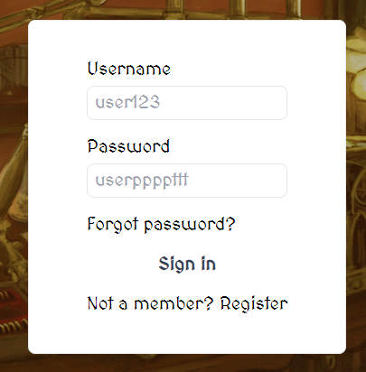

# Discounts & Deliveries
Fantasy themed storefront with game inspired displays

## Table of Contents
* [General Info](#general-information)
* [Technologies Used](#technologies-used)
* [Features](#features)
* [Screenshots](#screenshots)
* [Project Status](#project-status)
* [Room for Improvement](#room-for-improvement)

## General Information
- After our team agreed upon a design goal for our project, namely, a storefront, the next question was, what would our store sell?
- While multiple ideas were discussed, the idea of a traditionally low tech yet iconic store, the fantasy shop, combined with modern front-end technology, was an appealing one.
- Fantasy was a shared passion between many team members, which allowed for us to easily throw ourselves into the work and have a clear goal.
<!-- You don't have to answer all the questions - just the ones relevant to your project. -->

## Technologies Used
- Typescript v4.7.2
- Java v8
- Angular v14.2.10
- Javalin v4.1.1
- Tailwind v3.2.4

## Features
- CRUD operations created with all endpoints
- Card based system reminiscent of classic fantasy games
- Non-standard currency display based on gold pieces
- 3D rotational effect on product items
- register/login
- persistent cart
- Dynamic color assignment for item rarities
- checkout capabilities

## Screenshots

<!-- If you have screenshots you'd like to share, include them here. -->

## Setup
For the frontend, you need to have node installed. Once node is installed, you can clone the repository and cd into frontend folder. Secondly, enter "npm i" in the terminal to install the dependecies/devdependecies. Lastly, once the node modules have been installed, enter "ng serve -o" in the terminal to start the Angular server and automatically open the default browser to the default address.

For the backend, you need to install Java 8. Once Java 8 is installed, you can clone the repository and cd into the backend folder. Secondly, open the backend folder in your development environment of choice, mine is Intellij Free Edition. Open the "pom.xml" file and reload those Maven dependencies. Lastly, run your program, the main entry point is the "/driver/Main.java".

## Project Status
Discounts & Deliveries is functionally complete!

## Room for Improvement
Many ideas we had were unable to be fully implemented, due to time constraints.

Room for improvement:
- Notifications based on user action
- Theme selection
- Individual product pages
